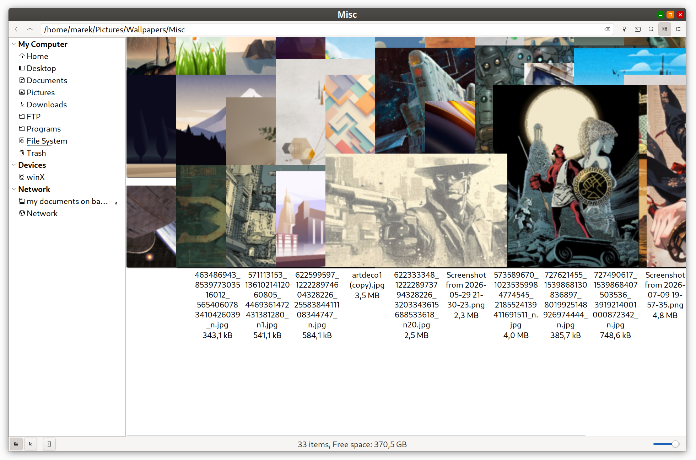
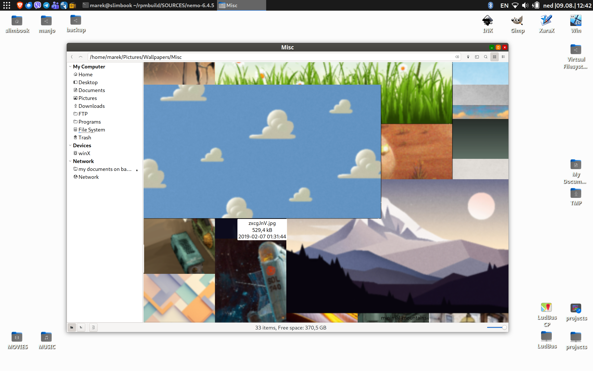

# Nemo Gallery Patch

## Turn Nemo's Icon View into a Gallery View

Nemo already has everything needed for a great gallery-style file browser.

## Icon View → Gallery View

This patch does not introduce a new view mode.

It fixes Nemo's existing **Icon View** so that it can properly behave as a **Gallery View** when large thumbnails are requested.

### "Gallery patched" Nemo:


### Mixed content:


### "Vanilla" Nemo tries to use large thumbnails:




### Default size, normal operation (both versions)


## The idea
The only setting you need to care about is:

```text
/org/nemo/icon-view/thumbnail-size
```

**Set it to whatever size you need.**

256 px. 512 px. 768 px. 1024 px. 2048 px.

With `nemo_gallery_patch`, the configured thumbnail size becomes the **source of truth** for the Icon View layout.

The larger the thumbnail, the larger the gallery.

---
```text
                 thumbnail-size
                        │
                        ▼
             ┌─────────────────────┐
             │ Thumbnail Geometry  │
             └──────────┬──────────┘
                        │
                        ▼
             ┌─────────────────────┐
             │     Nemo Icon View  │
             │                     │
             │    → Gallery View   │
             └─────────────────────┘
```

Set the size you want and Nemo follows it.

For example:

```bash
gsettings set org.nemo.icon-view thumbnail-size 512
```

Or:

```bash
gsettings set org.nemo.icon-view thumbnail-size 1024
```

There is no special "gallery size".

**`thumbnail-size` is the source of truth.**

---

## Why this "Gallery patch"?

Standard Nemo works well with its normal thumbnail sizes.

The problem starts when thumbnails become significantly larger than the values Nemo's Icon View was designed around.

It becomes particularly noticeable once thumbnails go beyond **255 pixels**.

The thumbnail itself can be enlarged, but the surrounding Icon View layout does not always scale with it correctly.

This can result in:

* incorrect item dimensions
* inconsistent spacing
* overlapping elements
* clipping
* thumbnails extending outside their expected area
* generally inconsistent layouts at large sizes

In other words, standard Nemo can be told to display a large thumbnail, but the **Icon View layout does not necessarily follow that size correctly**.

---

## What this patch changes

`nemo_gallery_patch` fixes the relationship between the thumbnail size and the geometry used by Icon View.

Instead of relying on the assumptions used for smaller thumbnails, the layout follows the configured thumbnail size.

The view remains consistent as the thumbnail size increases.

---

## Why call it Gallery View?

Because at larger values, Nemo's Icon View becomes much more useful for visual content.

For example:

* photographs
* image collections
* wallpapers
* artwork
* screenshots
* video thumbnails

Rather than seeing a grid of tiny icons, you get a proper visual browsing experience.

And importantly, it is still Nemo's existing Icon View.

No separate application.

No new configuration system.

No new view mode.

Just:

```text
Icon View
    +
large thumbnail-size
    +
correct layout geometry
    =
Gallery View
```

---

## Source of truth

The important setting is:

```text
/org/nemo/icon-view/thumbnail-size
```

You can inspect it with:

```bash
gsettings get org.nemo.icon-view thumbnail-size
```

And change it with:

```bash
gsettings set org.nemo.icon-view thumbnail-size 512
```

Use whatever value makes sense for your display and workflow.

The patch does not impose a predefined "gallery size".

**You choose the size.**

---

## Tested with

**Nemo 6.4.5**

The patch has been tested and confirmed to work with this version.

---
